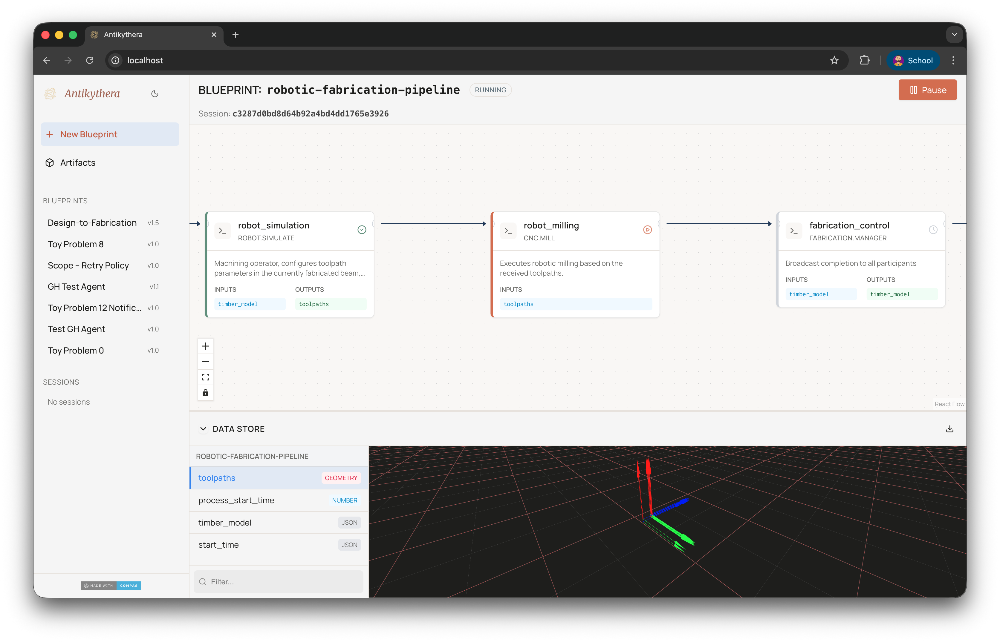

<div align="center">

[](https://compas.dev)
[](https://pypi.python.org/pypi/antikythera-sdk)
[](https://pypi.python.org/pypi/antikythera-sdk)

</div>

<h1> Antikythera</h1>

> *An all knowing, all controlling, robotic and otherwise, process manager.*



Antikythera is an distributed system for orchestration of fabrication processes in the context of architecture and construction.

## Installation

Stable releases can be installed from PyPI.

```bash
pip install antikythera
```

To install the latest version for development, do:

```bash
git clone https://github.com/gramaziokohler/antikythera.git
cd antikythera
pip install -e ".[dev]"
```

## Documentation

For further "getting started" instructions, a tutorial, examples, and an API reference,
please check out the online documentation here: [antikythera docs](https://gramaziokohler.github.io/antikythera)

## Docker

```bash
git clone https://github.com/gramaziokohler/antikythera.git
cd antikythera
docker compose build           # build the image (only needed once, or after code changes)
docker compose up -d           # start all services
```

This builds the `antikythera:latest` image and starts all services (Redis, MQTT broker, orchestrator, agents, frontend). To restart without rebuilding, just run `docker compose up -d` again.

## Issue Tracker

If you find a bug or if you have a problem with running the code, please file an issue on the [Issue Tracker](https://github.com/gramaziokohler/antikythera/issues).
