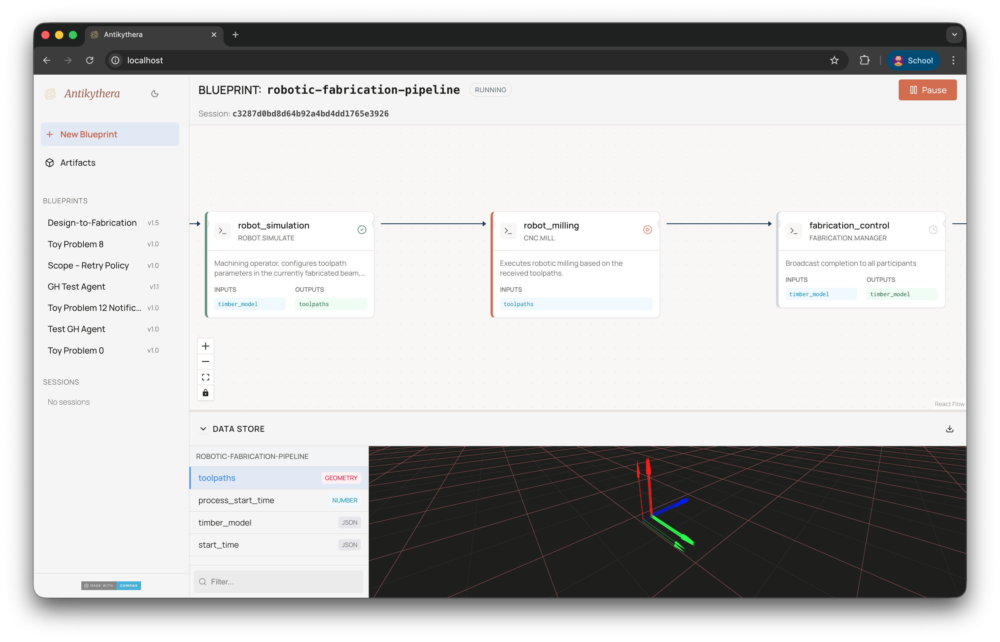

<div align="center">

[](https://compas.dev)
[](https://pypi.python.org/pypi/antikythera-sdk)
[](https://hub.docker.com/r/gramaziokohler/antikythera)
[](https://hub.docker.com/r/gramaziokohler/antikythera-frontend)
[](https://pypi.python.org/pypi/antikythera-sdk)
[](https://doi.org/10.5281/zenodo.20297856)


</div>

<h1> Antikythera</h1>

> *An all knowing, all controlling, robotic and otherwise, process manager.*



Antikythera is an distributed system for orchestration of fabrication processes in the context of architecture and construction.

## Installation

Stable releases can be installed from PyPI.

```bash
pip install antikythera
```

To install the latest version for development, do:

```bash
git clone https://github.com/gramaziokohler/antikythera.git
cd antikythera
pip install -e ".[dev]"
```

## Documentation

For further "getting started" instructions, a tutorial, examples, and an API reference,
please check out the online documentation here: [antikythera docs](https://gramaziokohler.github.io/antikythera)

## Running Antikythera

The orchestrator, the system agents and the web UI are published as Docker images, so a
complete installation needs no clone and no build:

```bash
curl -O https://raw.githubusercontent.com/gramaziokohler/antikythera/main/deploy/docker-compose.yml
docker compose up -d
```

Then open <http://localhost:8080>. See [Run with Docker](https://gramaziokohler.github.io/antikythera/deployment/docker/)
for configuration, connecting your own agents, and updating, or
[Run on bare metal](https://gramaziokohler.github.io/antikythera/deployment/bare-metal/)
to run the services without Docker.

### Development stack

The `docker-compose.yml` in the repository root is the *development* setup: it builds both
images from local source (the frontend from a sibling `antikythera-frontend` checkout) and
runs the orchestrator with auto-reload.

```bash
docker compose build           # build the images (only needed once, or after code changes)
docker compose up -d           # start all services
```

## Issue Tracker

If you find a bug or if you have a problem with running the code, please file an issue on the [Issue Tracker](https://github.com/gramaziokohler/antikythera/issues).
